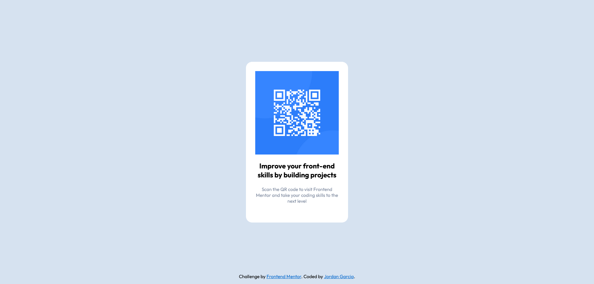

# Frontend Mentor - QR code component solution

This is a solution to the [QR code component challenge on Frontend Mentor](https://www.frontendmentor.io/challenges/qr-code-component-iux_sIO_H). Frontend Mentor challenges help you improve your coding skills by building realistic projects. 

## Table of contents

- [Overview](#overview)
  - [Screenshot](#screenshot)
  - [Links](#links)
- [My process](#my-process)
  - [Built with](#built-with)
  - [What I learned](#what-i-learned)
  - [Continued development](#continued-development)
- [Author](#author)

**Note: Delete this note and update the table of contents based on what sections you keep.**

## Overview

### Screenshot

### Links

- Solution URL: [https://jdgarcia277.github.io/frontend-qr-code/](https://jdgarcia277.github.io/frontend-qr-code/)

## My process

### Built with

- Semantic HTML5 markup
- CSS custom properties
- Flexbox

### What I learned

I got more practice with media queries for the mobile view. I used the different devices on Google Chromes Dev tools to help with even the smallest of devices. I did not utilize a mobile first approach with this project, but I will in the future.

### Continued development

Mobile First Approach

## Author

- Website - [Jordan Garcia](#)
- Frontend Mentor - [@jdgarcia277](https://www.frontendmentor.io/profile/jdgarcia277)

